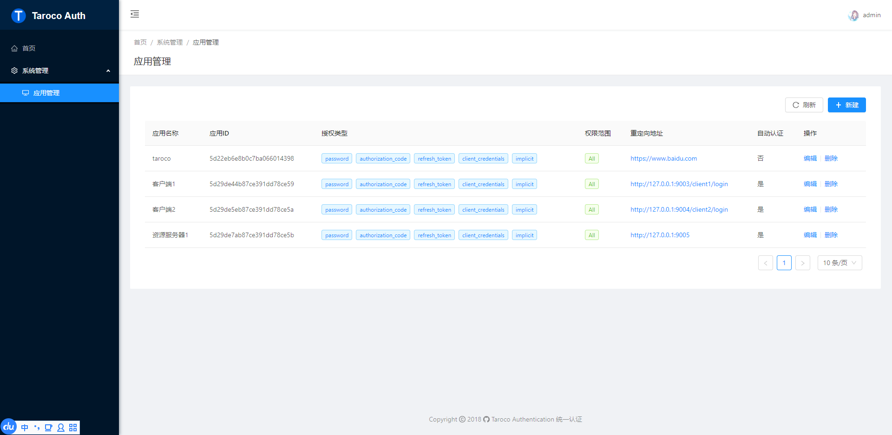
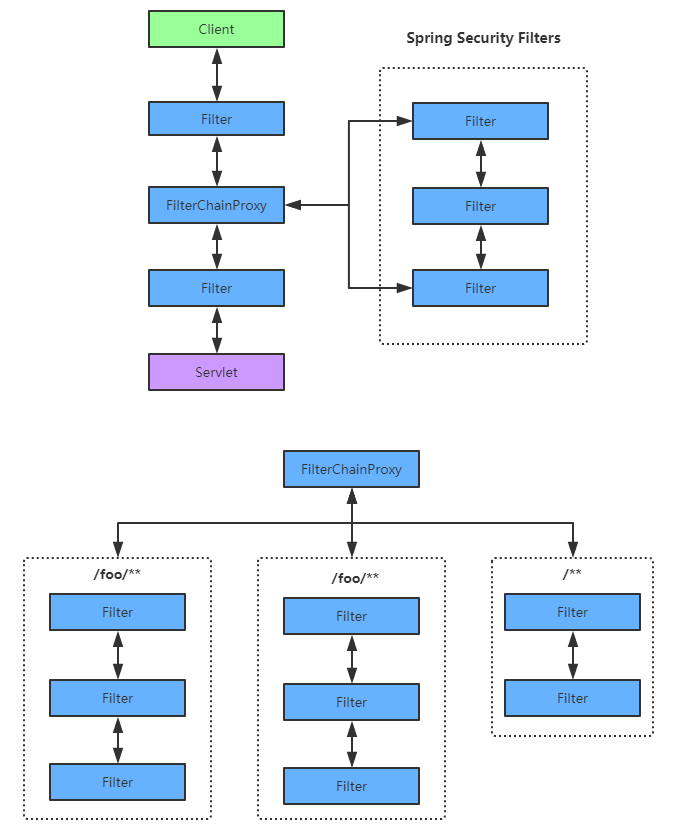
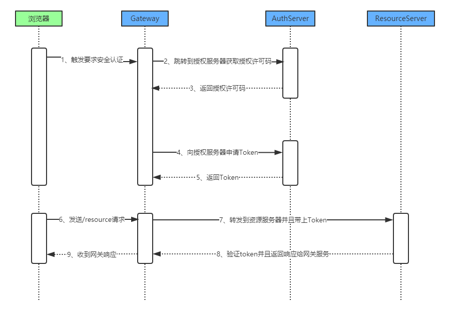
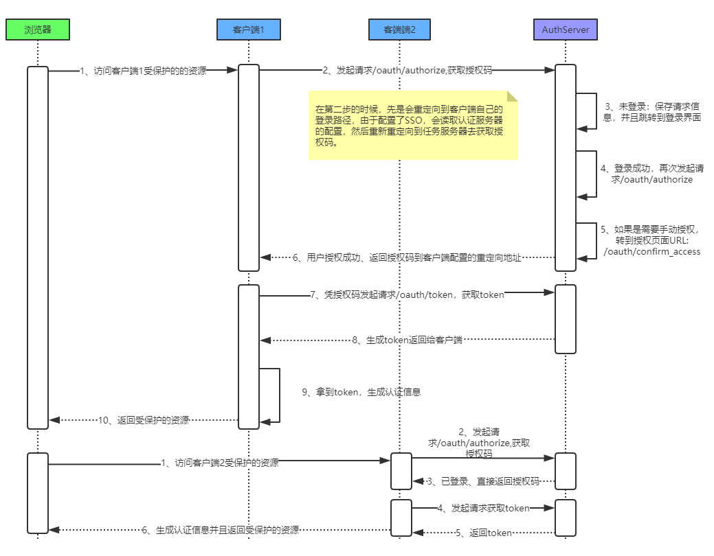

# Taroco-Authentication 统一认证服务

[](https://github.com/liuht777/Taroco-Authentication)
[](https://app.codacy.com/app/liuht777/Taroco-Authentication?utm_source=github.com&utm_medium=referral&utm_content=liuht777/Taroco-Authentication&utm_campaign=Badge_Grade_Dashboard)
[](https://github.com/liuht777/Taroco-Authentication)
[](https://github.com/liuht777/Taroco/blob/master/LICENSE)

基于 Spring Security Oauth2 的统一认证服务，采用 [Ant Design Pro of Vue](https://pro.loacg.com/docs/getting-started "Ant Design Pro of Vue") 作为前端界面，重写了 Spring Security 登录模式，支持异步登录，所有接口以及授权端点都支持异步的方式。




## 支持特性

- 支持异步 JSON 登录
- 支持手机号、验证码登录
- 支持 SSO
- 支持 JWT Token
- 支持 Redis Token
- 支持集群部署（已集成 Spring Session）
- 支持 OAuth2.0 定义的四种授权码模式以及刷新 token
- 支持通过手机号和验证码获取 token（类似 password模式）
- 集成了应用管理的功能，方便应用接入
- 完整的 Demo 示例，包括 SSO、Resource Server，以及在 Resource Server 中解析token，获取用户的权限以及认证中添加的额外信息

## Postman 接口调试

前端界面已经集成到 Spring Boot，只需要启动一个后端服务即可。`docs/Taroco Authentication.postman_collection.json` 已导出，请自行导入到 Postman 进行接口调试。

## Spring Security 过滤器解析

Spring Security 默认是通过 WebSecurityConfigurerAdapter.getHttp() 方法配置进来的。通过继承 WebSecurityConfigurerAdapter 类并且重写 configure(HttpSecurity http) 方法，可以定义自己的 Spring Security 配置。

|名称   |简介   |
| :------------ | :------------ |
|WebAsyncManagerIntegrationFilter   |将SecurityContext与Spring Web中用于处理异步请求映射的 WebAsyncManager 进行集成。   |
|SecurityContextPersistenceFilter   |将SecurityContext绑定到SecurityContextHolder，以及最后的清空SecurityContextHolder   |
|HeaderWriterFilter   |将指定的头部信息写入响应对象   |
|CsrfFilter   |防止跨站请求伪造，对请求进行csrf保护   |
|LogoutFilter   |检测用户退出登录请求并做相应退出登录处理   |
|UsernamePasswordAuthenticationFilter   |检测用户名/密码表单登录认证请求并作相应认证处理: 1.session管理，比如为新登录用户创建新session(session fixation防护)和设置新的csrf token等 2.经过完全认证的Authentication对象设置到SecurityContextHolder中的SecurityContext上; 3.发布登录认证成功事件InteractiveAuthenticationSuccessEvent 4.登录认证成功时的Remember Me处理 5.登录认证成功时的页面跳转 |
|BasicAuthenticationFilter   |检测和处理http basic认证，认证信息以 Authorization : Basic [Token] 方式填充进 HTTPHeader。Token组成方式为username:password 并进行base64转码。   |
|RequestCacheAwareFilter   |提取请求缓存中缓存的请求 1.请求缓存在安全机制启动时指定 2.请求写入缓存在其他地方完成 3.典型应用场景: (1).用户请求保护的页面， (2).系统引导用户完成登录认证, (3).然后自动跳转到到用户最初请求页面   |
|SecurityContextHolderAwareRequestFilter   |包装请求对象使之可以访问SecurityContextHolder,从而使请求真正意义上拥有接口HttpServletRequest中定义的getUserPrincipal这种访问安全信息的能力   |
|RememberMeAuthenticationFilter   |针对Remember Me登录认证机制的处理逻辑   |
|AnonymousAuthenticationFilter   |如果当前SecurityContext属性Authentication为null，将其替换为一个AnonymousAuthenticationToken   |
|SessionManagementFilter   |检测从请求处理开始到目前是否有用户登录认证，如果有做相应的session管理，比如针对为新登录用户创建新的session(session fixation防护)和设置新的csrf token等。   |
|ExceptionTranslationFilter   |处理AccessDeniedException和 AuthenticationException异常，将它们转换成相应的HTTP响应   |
|FilterSecurityInterceptor   |一个请求的安全处理过滤器链的最后一个，检查用户是否已经认证,如果未认证执行必要的认证，对目标资源的权限检查，如果认证或者权限不足，抛出相应的异常:AccessDeniedException或者AuthenticationException   |

注意:
* 上面的 Filter 并不总是同时被起用，根据配置的不同，会启用不同的Filter。
* 对于被起用的Filter，在对一个请求进行处理时，位于以上表格上部的过滤器先被调用。
* 上面的Filter被启用时并不是直接添加到Servlet容器的Filter chain中,而是先被组织成一个FilterChainProxy, 然后这个Filter会被添加到Servlet容器的Filter chain中。
* 上面的Spring Security Filter被组合到一个FilterChainProxy的过程可以参考配置类WebSecurityConfiguration的方法Filter springSecurityFilterChain(),这是一个bean定义方法，使用的bean名称为AbstractSecurityWebApplicationInitializer.DEFAULT_FILTER_NAME:springSecurityFilterChain。
> FilterChainProxy也是一个Filter,它应用了代理模式和组合模式，它将上面的各个Filter组织到一起在自己内部形成一个filter chain,当自己被调用到时，它其实把任务代理给自己内部的filter chain完成。

> Spring Security 有两个重要的入口Filter, 一个是 AbstractAuthenticationProcessingFilter（主要负责处理登录认证）；一个是 FilterSecurityInterceptor（主要处理鉴权）。
> UsernamePasswordAuthenticationFilter 就是 AbstractAuthenticationProcessingFilter 其中的一个实现类。后面对登录认证的扩展，主要就是对 AbstractAuthenticationProcessingFilter 的扩展。

## Spring Security 认证流程

Spring 针对 servlet 默认有一个过滤器链（Filter chain），Spring Security 本质上也是一个连续的 Filter 链，然后又以 FilterChainProxy 的形式被添加到 Servlet 容器的 Filter chain 当中。默认是使用 DefaultSecurityFilterChain，名称为：AbstractSecurityWebApplicationInitializer.DEFAULT_FILTER_NAME:springSecurityFilterChain。下图展示了 springSecurityFilterChain 是如何嵌入Servlet 容器的 Filter chain 当中:



我们以 Spring Security 用户名/密码登录为例展示认证的整体流程如下:


> 上图流程只是针对认证成功的主流程，实际上这任何一个环节都有可能失败，这时候会进入到 ExceptionTranslationFilter 过滤器进行处理。

## Spring Security 自定义开发

### 实现异步 JSON 登录

通过熟悉 Spring Security 的认证流程我们知道，读取登录请求参数的地方是在 UsernamePasswordAuthenticationFilter，要想实现异步登录，首先想到的就是重写它。
但是为了能够使表单登录和异步登录同时有效，我们需要继承 UsernamePasswordAuthenticationFilter，加入自己的逻辑。

1. 继承 UsernamePasswordAuthenticationFilter

```java
/**
 * 重写 UsernamePasswordAuthenticationFilter 类, 支持实现异步JSON登录
 *
 * @author liuht
 * 2019/7/3 14:09
 */
@Slf4j
public class CustomUsernamePasswordAuthenticationFilter extends UsernamePasswordAuthenticationFilter {

    @Override
    public Authentication attemptAuthentication(HttpServletRequest request, HttpServletResponse response) throws AuthenticationException {

        // 如果是JSON登录
        UsernamePasswordAuthenticationToken authRequest;
        if (request.getContentType().equals(MediaType.APPLICATION_JSON_UTF8_VALUE)
                || request.getContentType().equals(MediaType.APPLICATION_JSON_VALUE)) {
            ObjectMapper mapper = new ObjectMapper();

            try (InputStream is = request.getInputStream()) {
                AuthenticationBean authenticationBean = mapper.readValue(is, AuthenticationBean.class);
                authRequest = new UsernamePasswordAuthenticationToken(
                        authenticationBean.getUsername(), authenticationBean.getPassword());
                setDetails(request, authRequest);
                return this.getAuthenticationManager().authenticate(authRequest);
            } catch (IOException e) {
                log.error("异步登陆失败", e);
            }
        } else {
            // 支持原来默认的登录方式
            return super.attemptAuthentication(request, response);
        }
        authRequest = new UsernamePasswordAuthenticationToken("", "");
        return this.getAuthenticationManager().authenticate(authRequest);
    }
}

/**
 * 用户认证的Bean
 *
 * @author liuht
 * 2019/7/3 14:11
 */
@Data
public class AuthenticationBean {

    private String username;

    private String password;
}
```

2. 将自定义的 Filter 添加到 Spring Security 过滤器链当中

```java
@EnableWebSecurity
public class WebSecurityConfigration extends WebSecurityConfigurerAdapter {
    
    @Override
    protected void configure(HttpSecurity http) throws Exception {
        http.addFilterAt(customAuthenticationFilter(), UsernamePasswordAuthenticationFilter.class);
    }
    
    /**
     * 注册自定义的UsernamePasswordAuthenticationFilter
     *
     * @throws Exception
     */
    @Bean
    public CustomUsernamePasswordAuthenticationFilter customAuthenticationFilter() throws Exception {
        CustomUsernamePasswordAuthenticationFilter filter = new CustomUsernamePasswordAuthenticationFilter();
        filter.setAuthenticationSuccessHandler(successHandler);
        filter.setAuthenticationFailureHandler(failureHandler);
        //这句很关键，重用WebSecurityConfigurerAdapter配置的AuthenticationManager，不然要自己组装AuthenticationManager
        filter.setAuthenticationManager(authenticationManagerBean());
        return filter;
    }
}
```

### 自定义手机号/验证码登录

同样的在用户名/密码登录流程中，我们可以发现最重要的几个地方也是我们自己实现别的登录方式需要重写的地方主要有三点：

1. UsernamePasswordAuthenticationFilter 认证的发起，读取认证参数，生成未认证的 AuthenticationToken，调用 AuthenticationManager 的认证方法。
2. AuthenticationProvider 认证器。AuthenticationManager 最终会调用 AuthenticationToken 对应的认证器进行用户认证。
3. AuthenticationToken 用户认证信息，保存认证过后的用户信息以及权限信息。UsernamePasswordAuthenticationToken 就是用户名/密码登录的一个实现。

我们分三步来实现自定义的手机号/验证码登录：

1. 第一步，自定义 SmsCodeAuthenticationToken

在这之前我先实现了一个 MyAuthenticationToken 类, 方便实现其他的登录方式, SmsCodeAuthenticationToken 只需要继承它即可：

```java
/**
 * 自定义AbstractAuthenticationToken
 *
 * @author liuht
 * 2019/5/13 15:25
 */
public class MyAuthenticationToken extends AbstractAuthenticationToken {

    private static final long serialVersionUID = 7129356369074220969L;
    protected final Object principal;
    protected Object credentials;

    public MyAuthenticationToken(Object principal, Object credentials) {
        super(null);
        this.principal = principal;
        this.credentials = credentials;
        this.setAuthenticated(false);
    }

    public MyAuthenticationToken(Object principal, Object credentials, Collection<? extends GrantedAuthority> authorities) {
        super(authorities);
        this.principal = principal;
        this.credentials = credentials;
        super.setAuthenticated(true);
    }


    @Override
    public Object getCredentials() {
        return this.credentials;
    }

    @Override
    public Object getPrincipal() {
        return this.principal;
    }

    @Override
    public void setAuthenticated(boolean isAuthenticated) throws IllegalArgumentException {
        if (isAuthenticated) {
            throw new IllegalArgumentException("Cannot set this token to trusted - use constructor which takes a GrantedAuthority list instead");
        } else {
            super.setAuthenticated(false);
        }
    }

    @Override
    public void eraseCredentials() {
        super.eraseCredentials();
        this.credentials = null;
    }
}

/**
 * 定义验证码登录系统
 *
 * @author liuht
 * 2019/7/12 14:04
 */
public class SmsCodeAuthenticationToken extends MyAuthenticationToken {

    private static final long serialVersionUID = 6056078576992222156L;

    public SmsCodeAuthenticationToken(final Object principal, final Object credentials) {
        super(principal, credentials);
    }

    public SmsCodeAuthenticationToken(final Object principal, final Object credentials, final Collection<? extends GrantedAuthority> authorities) {
        super(principal, credentials, authorities);
    }
}
```

2. 第二步，自定义 SmsCodeAuthenticationProvider

同样的，我先抽象了一个 AbstractUserDetailsAuthenticationProvider 类，将 createSuccessAuthentication、additionalAuthenticationChecks、retrieveUser 三个方法交由 SmsCodeAuthenticationProvider 去实现。
这样同样方便实现其他的登录方式。

```java
/**
 * 自定义 AuthenticationProvider， 以使用自定义的 MyAuthenticationToken
 *
 * @author liuht
 * 2019/5/13 15:25
 */
@Slf4j
public abstract class AbstractUserDetailsAuthenticationProvider implements AuthenticationProvider, InitializingBean, MessageSourceAware {

    protected MessageSourceAccessor messages = SpringSecurityMessageSource.getAccessor();
    private UserCache userCache = new NullUserCache();
    private boolean forcePrincipalAsString = false;
    protected boolean hideUserNotFoundExceptions = true;
    private UserDetailsChecker preAuthenticationChecks = new AbstractUserDetailsAuthenticationProvider.DefaultPreAuthenticationChecks();
    private UserDetailsChecker postAuthenticationChecks = new AbstractUserDetailsAuthenticationProvider.DefaultPostAuthenticationChecks();

    @Override
    public final void afterPropertiesSet() throws Exception {
        Assert.notNull(this.userCache, "A user cache must be set");
        Assert.notNull(this.messages, "A message source must be set");
    }

    @Override
    public Authentication authenticate(Authentication authentication) throws AuthenticationException {
        String username = authentication.getPrincipal() == null ? "NONE_PROVIDED" : authentication.getName();
        boolean cacheWasUsed = true;
        UserDetails user = this.userCache.getUserFromCache(username);
        if (user == null) {
            cacheWasUsed = false;

            try {
                user = this.retrieveUser(username, authentication);
            } catch (UsernameNotFoundException var6) {
                log.error("User \'" + username + "\' not found");
                if (this.hideUserNotFoundExceptions) {
                    throw new BadCredentialsException(this.messages.getMessage("AbstractUserDetailsAuthenticationProvider.badCredentials", "Bad credentials"));
                }

                throw var6;
            }

            Assert.notNull(user, "retrieveUser returned null - a violation of the interface contract");
        }

        try {
            this.preAuthenticationChecks.check(user);
            this.additionalAuthenticationChecks(user, authentication);
        } catch (AuthenticationException var7) {
            if (!cacheWasUsed) {
                throw var7;
            }

            cacheWasUsed = false;
            user = this.retrieveUser(username, authentication);
            this.preAuthenticationChecks.check(user);
            this.additionalAuthenticationChecks(user, authentication);
        }

        this.postAuthenticationChecks.check(user);
        if (!cacheWasUsed) {
            this.userCache.putUserInCache(user);
        }

        Object principalToReturn = user;
        if (this.forcePrincipalAsString) {
            principalToReturn = user.getUsername();
        }

        return this.createSuccessAuthentication(principalToReturn, authentication, user);
    }

    /**
     * 创建自定义的 Authentication 实现
     *
     * @param principal
     * @param authentication
     * @param user
     * @return
     */
    protected abstract Authentication createSuccessAuthentication(Object principal, Authentication authentication, UserDetails user);

    /**
     * 校验 authentication 有效性
     *
     * @param userDetails
     * @param authentication
     */
    protected abstract void additionalAuthenticationChecks(UserDetails userDetails, Authentication authentication) throws AuthenticationException;

    /**
     * 获取 UserDetails 详情
     *
     * @param principal
     * @param authentication
     * @return
     */
    protected abstract UserDetails retrieveUser(String principal, Authentication authentication) throws AuthenticationException;

    public UserCache getUserCache() {
        return this.userCache;
    }

    public boolean isForcePrincipalAsString() {
        return this.forcePrincipalAsString;
    }

    public boolean isHideUserNotFoundExceptions() {
        return this.hideUserNotFoundExceptions;
    }

    public void setForcePrincipalAsString(boolean forcePrincipalAsString) {
        this.forcePrincipalAsString = forcePrincipalAsString;
    }

    public void setHideUserNotFoundExceptions(boolean hideUserNotFoundExceptions) {
        this.hideUserNotFoundExceptions = hideUserNotFoundExceptions;
    }

    @Override
    public void setMessageSource(MessageSource messageSource) {
        this.messages = new MessageSourceAccessor(messageSource);
    }

    public void setUserCache(UserCache userCache) {
        this.userCache = userCache;
    }

    protected UserDetailsChecker getPreAuthenticationChecks() {
        return this.preAuthenticationChecks;
    }

    public void setPreAuthenticationChecks(UserDetailsChecker preAuthenticationChecks) {
        this.preAuthenticationChecks = preAuthenticationChecks;
    }

    protected UserDetailsChecker getPostAuthenticationChecks() {
        return this.postAuthenticationChecks;
    }

    public void setPostAuthenticationChecks(UserDetailsChecker postAuthenticationChecks) {
        this.postAuthenticationChecks = postAuthenticationChecks;
    }

    private class DefaultPostAuthenticationChecks implements UserDetailsChecker {
        private DefaultPostAuthenticationChecks() {
        }

        @Override
        public void check(UserDetails user) {
            if (!user.isCredentialsNonExpired()) {
                log.debug("User account credentials have expired");
                throw new CredentialsExpiredException(AbstractUserDetailsAuthenticationProvider.this.messages.getMessage("AbstractUserDetailsAuthenticationProvider.credentialsExpired", "User credentials have expired"));
            }
        }
    }

    private class DefaultPreAuthenticationChecks implements UserDetailsChecker {
        private DefaultPreAuthenticationChecks() {
        }

        @Override
        public void check(UserDetails user) {
            if (!user.isAccountNonLocked()) {
                log.debug("User account is locked");
                throw new LockedException(AbstractUserDetailsAuthenticationProvider.this.messages.getMessage("AbstractUserDetailsAuthenticationProvider.locked", "User account is locked"));
            } else if (!user.isEnabled()) {
                log.debug("User account is disabled");
                throw new DisabledException(AbstractUserDetailsAuthenticationProvider.this.messages.getMessage("AbstractUserDetailsAuthenticationProvider.disabled", "User is disabled"));
            } else if (!user.isAccountNonExpired()) {
                log.debug("User account is expired");
                throw new AccountExpiredException(AbstractUserDetailsAuthenticationProvider.this.messages.getMessage("AbstractUserDetailsAuthenticationProvider.expired", "User account has expired"));
            }
        }
    }
}

/**
 * 手机验证码登录系统 Provider
 *
 * @author liuht
 * 2019/7/12 14:35
 */
@Slf4j
public class SmsCodeAuthenticationProvider extends AbstractUserDetailsAuthenticationProvider {

    private UserDetailsService userDetailsService;

    private TarocoRedisRepository redisRepository;

    @Override
    protected Authentication createSuccessAuthentication(final Object principal, final Authentication authentication, final UserDetails user) {
        final SmsCodeAuthenticationToken token = new SmsCodeAuthenticationToken(principal, authentication.getCredentials(), user.getAuthorities());
        token.setDetails(authentication.getDetails());
        return token;
    }

    @Override
    protected void additionalAuthenticationChecks(final UserDetails userDetails, final Authentication authentication) throws AuthenticationException {
        if (authentication.getCredentials() == null) {
            log.error("Authentication failed: no credentials provided");
            throw new BadCredentialsException(this.messages.getMessage("MobileAuthenticationProvider.badCredentials", "Bad credentials"));
        } else {
            final String presentedPassword = authentication.getCredentials().toString();
            final Object principal = authentication.getPrincipal();
            final String key = CacheConstants.DEFAULT_CODE_KEY + principal;
            final String code = redisRepository.get(key);
            // 校验验证码
            if (StrUtil.isEmpty(code) || !code.equals(presentedPassword)) {
                log.error("Authentication failed: verifyCode does not match stored value");
                throw new BadCredentialsException(this.messages.getMessage("MobileAuthenticationProvider.badCredentials", "Bad verifyCode"));
            }
            // 校验成功删除验证码(验证码只能使用一次)
            redisRepository.del(key);
        }
    }

    @Override
    protected UserDetails retrieveUser(final String mobile, final Authentication authentication) throws AuthenticationException {
        UserDetails loadedUser;
        try {
            loadedUser = userDetailsService.loadUserByUsername(mobile);
        } catch (UsernameNotFoundException var6) {
            throw var6;
        } catch (Exception var7) {
            throw new InternalAuthenticationServiceException(var7.getMessage(), var7);
        }
        if (loadedUser == null) {
            throw new InternalAuthenticationServiceException("UserDetailsService returned null, which is an interface contract violation");
        } else {
            return loadedUser;
        }
    }

    @Override
    public boolean supports(final Class<?> authentication) {
        return SmsCodeAuthenticationToken.class.isAssignableFrom(authentication);
    }

    public UserDetailsService getUserDetailsService() {
        return userDetailsService;
    }

    public void setUserDetailsService(final UserDetailsService userDetailsService) {
        this.userDetailsService = userDetailsService;
    }

    public TarocoRedisRepository getRedisRepository() {
        return redisRepository;
    }

    public void setRedisRepository(final TarocoRedisRepository redisRepository) {
        this.redisRepository = redisRepository;
    }
}
```

> 在 SmsCodeAuthenticationProvider 类中有个 supports 方法，该方法决定了 AuthenticationManager 该调用哪个 AuthenticationProvider 的认证方法。
通过判断 authentication 是否是我们自定义的 SmsCodeAuthenticationToken 实现类。

3. 第三步，自定义 SmsCodeAuthenticationFilter

```java
/**
 * 自定义手机号验证码登录系统
 *
 * @author liuht
 * 2019/7/12 14:13
 */
public class SmsCodeAuthenticationFilter extends AbstractAuthenticationProcessingFilter {

    private static final String SPRING_SECURITY_RESTFUL_PHONE_KEY = "mobile";
    private static final String SPRING_SECURITY_RESTFUL_VERIFY_CODE_KEY = "code";

    private boolean postOnly = true;

    public SmsCodeAuthenticationFilter() {
        super(new AntPathRequestMatcher(SecurityConstants.MOBILE_LOGIN_URL, HttpMethod.POST.name()));
    }

    @Override
    public Authentication attemptAuthentication(final HttpServletRequest request, final HttpServletResponse response) throws AuthenticationException, IOException, ServletException {
        if (postOnly && !request.getMethod().equals(HttpMethod.POST.name())) {
            throw new AuthenticationServiceException(
                    "Authentication method not supported: " + request.getMethod());
        }
        String principal;
        String credentials;
        // 1. 从请求中获取参数 mobile + smsCode
        principal = obtainParameter(request, SPRING_SECURITY_RESTFUL_PHONE_KEY);
        credentials = obtainParameter(request, SPRING_SECURITY_RESTFUL_VERIFY_CODE_KEY);
        principal = principal.trim();
        SmsCodeAuthenticationToken authRequest = new SmsCodeAuthenticationToken(principal, credentials);
        this.setDetails(request, authRequest);
        // 3. 返回 authenticated 方法的返回值
        return this.getAuthenticationManager().authenticate(authRequest);
    }

    private String obtainParameter(HttpServletRequest request, String parameter) {
        String result =  request.getParameter(parameter);
        return result == null ? "" : result;
    }

    protected void setDetails(HttpServletRequest request, SmsCodeAuthenticationToken authRequest) {
        authRequest.setDetails(this.authenticationDetailsSource.buildDetails(request));
    }

    public void setPostOnly(boolean postOnly) {
        this.postOnly = postOnly;
    }

    public boolean isPostOnly() {
        return postOnly;
    }
}
```

> 在这里通过获取参数生成我们自定义的 SmsCodeAuthenticationToken，交给 AuthenticationManager 进行认证。
> 同时我们自定义的这个 url 需要添加到 Spring Security 放行的队列当中。

最后，需要将我们自定义的内容加入到 Spring Security 的配置当中:

```
@Override
protected void configure(HttpSecurity http) throws Exception {
    http.addFilterAfter(smsCodeAuthenticationFilter(), UsernamePasswordAuthenticationFilter.class);
}

@Override
protected void configure(AuthenticationManagerBuilder auth) throws Exception {
    auth
            // 加入自定义的认证器之前需要先添加默认的用户名密码认证器
            .authenticationProvider(daoAuthenticationProvider())
            // 手机号验证码登录认证器
            .authenticationProvider(smsCodeAuthenticationProvider());
}

/**
 * 手机号验证码登录filter
 */
@Bean
public SmsCodeAuthenticationFilter smsCodeAuthenticationFilter() throws Exception {
    final SmsCodeAuthenticationFilter filter = new SmsCodeAuthenticationFilter();
    filter.setAuthenticationManager(authenticationManagerBean());
    filter.setAuthenticationSuccessHandler(successHandler);
    filter.setAuthenticationFailureHandler(failureHandler);
    return filter;
}

/**
 * 手机号验证码登录认证逻辑
 */
@Bean
public SmsCodeAuthenticationProvider smsCodeAuthenticationProvider() {
    final SmsCodeAuthenticationProvider provider = new SmsCodeAuthenticationProvider();
    provider.setRedisRepository(redisRepository);
    provider.setUserDetailsService(mobileUserDetailsService);
    provider.setHideUserNotFoundExceptions(false);
    return provider;
}

```

## Spring Security OAuth2 授权码模式流程

授权码模式是 OAuth2 中最安全的模式，也是最复杂的，我只列举这一个，其他的也是触类旁通，一点即透。



## Spring Security OAuth2 SSO 流程

Spring Security 通过 OAuth2 实现的 SSO，虽然流程较为复杂，但是好在复杂的东西已经封装的非常完美，使用起来只需要一个注解即可搞定。
我们需要对流程有充分的理解，这样在进行扩展和调试的时候才知道从什么地方入手。



## Spring Security OAuth2 自定义开发

### 自定义通过手机号/验证码获取token

和自定义通过手机号/验证码登录十分相似，唯一的不同是在登录认证成功以后，需要返回 token，而不是跳转页面。

1. 第一步，自定义 MobileTokenAuthenticationToken

```java
/**
 * 定义手机号获取token 类似与 UsernamePasswordAuthenticationToken
 *
 * @author liuht
 * 2019/5/13 15:20
 */
public class MobileTokenAuthenticationToken extends MyAuthenticationToken {

    private static final long serialVersionUID = -9192173797915966518L;

    public MobileTokenAuthenticationToken(Object principal, Object credentials) {
        super(principal, credentials);
    }

    public MobileTokenAuthenticationToken(Object principal, Object credentials, Collection<? extends GrantedAuthority> authorities) {
        super(principal, credentials, authorities);
    }
}
```

2. 第二步，自定义 SmsCodeAuthenticationProvider

```java
/**
 * 定义手机号获取token校验逻辑
 *
 * @author liuht
 * 2019/5/13 15:25
 */
@Slf4j
public class MobileTokenAuthenticationProvider extends AbstractUserDetailsAuthenticationProvider {

    private UserDetailsService userDetailsService;

    private TarocoRedisRepository redisRepository;

    @Override
    protected Authentication createSuccessAuthentication(final Object principal, final Authentication authentication, final UserDetails user) {
        final MobileTokenAuthenticationToken token = new MobileTokenAuthenticationToken(principal, authentication.getCredentials(), user.getAuthorities());
        token.setDetails(authentication.getDetails());
        return token;
    }

    @Override
    protected void additionalAuthenticationChecks(final UserDetails userDetails, final Authentication authentication) throws AuthenticationException {
        if (authentication.getCredentials() == null) {
            log.error("Authentication failed: no credentials provided");
            throw new BadCredentialsException(this.messages.getMessage("MobileAuthenticationProvider.badCredentials", "Bad credentials"));
        } else {
            final String presentedPassword = authentication.getCredentials().toString();
            final Object principal = authentication.getPrincipal();
            final String key = CacheConstants.DEFAULT_CODE_KEY + principal;
            final String code = redisRepository.get(key);
            // 校验验证码
            if (StrUtil.isEmpty(code) || !code.equals(presentedPassword)) {
                log.error("Authentication failed: verifyCode does not match stored value");
                throw new BadCredentialsException(this.messages.getMessage("MobileAuthenticationProvider.badCredentials", "Bad verifyCode"));
            }
            // 校验成功删除验证码(验证码只能使用一次)
            redisRepository.del(key);
        }
    }

    @Override
    protected UserDetails retrieveUser(final String mobile, final Authentication authentication) throws AuthenticationException {
        UserDetails loadedUser;
        try {
            loadedUser = userDetailsService.loadUserByUsername(mobile);
        } catch (UsernameNotFoundException var6) {
            throw var6;
        } catch (Exception var7) {
            throw new InternalAuthenticationServiceException(var7.getMessage(), var7);
        }
        if (loadedUser == null) {
            throw new InternalAuthenticationServiceException("UserDetailsService returned null, which is an interface contract violation");
        } else {
            return loadedUser;
        }
    }

    @Override
    public boolean supports(final Class<?> authentication) {
        return MobileTokenAuthenticationToken.class.isAssignableFrom(authentication);
    }

    public UserDetailsService getUserDetailsService() {
        return userDetailsService;
    }

    public void setUserDetailsService(final UserDetailsService userDetailsService) {
        this.userDetailsService = userDetailsService;
    }

    public TarocoRedisRepository getRedisRepository() {
        return redisRepository;
    }

    public void setRedisRepository(final TarocoRedisRepository redisRepository) {
        this.redisRepository = redisRepository;
    }
}
```

3. 第三步，自定义 MobileTokenAuthenticationFilter

```java
/**
 * 手机号获取token登录认证filter
 * 通过手机号直接获取 token
 *
 * @author liuht
 * 2019/5/13 15:37
 */
public class MobileTokenAuthenticationFilter extends AbstractAuthenticationProcessingFilter {

    private static final String SPRING_SECURITY_RESTFUL_PHONE_KEY = "mobile";
    private static final String SPRING_SECURITY_RESTFUL_VERIFY_CODE_KEY = "code";

    private boolean postOnly = true;

    public MobileTokenAuthenticationFilter() {
        // 定义一个指定路径的手机号登录前缀
        super(new AntPathRequestMatcher(SecurityConstants.MOBILE_TOKEN_URL, HttpMethod.POST.name()));
    }

    @Override
    public Authentication attemptAuthentication(final HttpServletRequest request, final HttpServletResponse response) throws AuthenticationException, IOException, ServletException {
        if (postOnly && !request.getMethod().equals(HttpMethod.POST.name())) {
            throw new AuthenticationServiceException(
                    "Authentication method not supported: " + request.getMethod());
        }

        AbstractAuthenticationToken authRequest;
        String principal;
        String credentials;

        // 手机验证码登陆
        principal = obtainParameter(request, SPRING_SECURITY_RESTFUL_PHONE_KEY);
        credentials = obtainParameter(request, SPRING_SECURITY_RESTFUL_VERIFY_CODE_KEY);

        principal = principal.trim();
        authRequest = new MobileTokenAuthenticationToken(principal, credentials);
        setDetails(request, authRequest);
        return this.getAuthenticationManager().authenticate(authRequest);
    }

    private String obtainParameter(HttpServletRequest request, String parameter) {
        String result =  request.getParameter(parameter);
        return result == null ? "" : result;
    }

    protected void setDetails(HttpServletRequest request,
                              AbstractAuthenticationToken authRequest) {
        authRequest.setDetails(authenticationDetailsSource.buildDetails(request));
    }

    public void setPostOnly(boolean postOnly) {
        this.postOnly = postOnly;
    }

    public boolean isPostOnly() {
        return postOnly;
    }
}
```

4. 自定义，MobileTokenLoginSuccessHandler MobileTokenLoginFailureHandler

```java
/**
 * 手机号登录成功, 直接返回token
 *
 * @author liuht
 * 2019/5/15 16:03
 * @see SavedRequestAwareAuthenticationSuccessHandler
 */
@Component
@Slf4j
@Data
public class MobileTokenLoginSuccessHandler implements AuthenticationSuccessHandler {

    @Autowired
    private ObjectMapper objectMapper;

    @Autowired
    private ClientDetailsService clientDetailsService;

    @Autowired
    private DefaultTokenServices tokenServices;

    @Override
    public void onAuthenticationSuccess(final HttpServletRequest request, final HttpServletResponse response, final Authentication authentication) throws IOException, ServletException {
        final String header = request.getHeader(SecurityConstants.AUTHORIZATION);

        if (header == null || !header.startsWith(SecurityConstants.BASIC_HEADER)) {
            throw new UnapprovedClientAuthenticationException("请求头中client信息为空");
        }
        try {
            final String[] tokens = extractAndDecodeHeader(header);
            assert tokens.length == 2;
            final String clientId = tokens[0];

            final ClientDetails clientDetails = clientDetailsService.loadClientByClientId(clientId);
            final TokenRequest tokenRequest = new TokenRequest(MapUtil.newHashMap(), clientId, clientDetails.getScope(), "mobile");
            final OAuth2Request oAuth2Request = tokenRequest.createOAuth2Request(clientDetails);

            final OAuth2Authentication oAuth2Authentication = new OAuth2Authentication(oAuth2Request, authentication);
            final OAuth2AccessToken oAuth2AccessToken = tokenServices.createAccessToken(oAuth2Authentication);
            if (log.isDebugEnabled()) {
                log.debug("MobileLoginSuccessHandler 签发token 成功：{}", oAuth2AccessToken.getValue());
            }

            response.setCharacterEncoding(StandardCharsets.UTF_8.name());
            response.setContentType(MediaType.APPLICATION_JSON_UTF8_VALUE);
            final PrintWriter printWriter = response.getWriter();
            printWriter.append(objectMapper.writeValueAsString(oAuth2AccessToken));
        } catch (IOException e) {
            throw new BadCredentialsException("Failed to decode basic authentication token");
        }
    }

    /**
     * Decodes the header into a username and password.
     *
     * @throws BadCredentialsException if the Basic header is not present or is not valid
     *                                 Base64
     */
    private String[] extractAndDecodeHeader(String header) throws IOException {
        final byte[] base64Token = header.substring(6).getBytes(StandardCharsets.UTF_8);
        byte[] decoded;
        try {
            decoded = Base64.decode(base64Token);
        } catch (IllegalArgumentException e) {
            throw new BadCredentialsException("Failed to decode basic authentication token");
        }
        final String token = new String(decoded, StandardCharsets.UTF_8);

        final int delim = token.indexOf(":");

        if (delim == -1) {
            throw new BadCredentialsException("Invalid basic authentication token");
        }
        return new String[] {token.substring(0, delim), token.substring(delim + 1)};
    }
}

/**
 * 手机登录失败返回
 *
 * @author liuht
 * 2019/5/16 9:37
 */
@Component
@Slf4j
public class MobileTokenLoginFailureHandler implements AuthenticationFailureHandler {

    @Autowired
    private ObjectMapper objectMapper;

    @Override
    public void onAuthenticationFailure(final HttpServletRequest request,
                                        final HttpServletResponse response,
                                        final AuthenticationException exception) throws IOException, ServletException {
        if (log.isDebugEnabled()) {
            log.debug("MobileLoginFailureHandler:" + exception.getMessage());
        }
        final Response resp = Response.failure(exception.getMessage());
        response.setStatus(HttpServletResponse.SC_UNAUTHORIZED);
        response.setContentType(MediaType.APPLICATION_JSON_UTF8_VALUE);
        response.getWriter().write(objectMapper.writeValueAsString(resp));
    }
}
```

5. 最后，配置到 Spring Security 当中去：

```
http.addFilterAfter(mobileTokenAuthenticationFilter(), UsernamePasswordAuthenticationFilter.class)

@Override
protected void configure(AuthenticationManagerBuilder auth) throws Exception {
    auth
            // 默认的用户名密码认证器
            .authenticationProvider(daoAuthenticationProvider())
            // 手机号获取token认证器
            .authenticationProvider(mobileTokenAuthenticationProvider());
}

/**
 * 手机号获取token过滤器
 */
@Bean
public MobileTokenAuthenticationFilter mobileTokenAuthenticationFilter() throws Exception {
    final MobileTokenAuthenticationFilter filter = new MobileTokenAuthenticationFilter();
    filter.setAuthenticationManager(authenticationManagerBean());
    filter.setAuthenticationSuccessHandler(mobileTokenLoginSuccessHandler);
    filter.setAuthenticationFailureHandler(mobileTokenLoginFailureHandler);
    return filter;
}

/**
 * 手机号获取token认证逻辑
 */
@Bean
public MobileTokenAuthenticationProvider mobileTokenAuthenticationProvider() {
    final MobileTokenAuthenticationProvider provider = new MobileTokenAuthenticationProvider();
    provider.setRedisRepository(redisRepository);
    provider.setUserDetailsService(mobileUserDetailsService);
    provider.setHideUserNotFoundExceptions(false);
    return provider;
}
```

## Spring Security 用户权限管理方案

### Scope & Authority

Scope 是客户端（应用）的权限范围，一般是 Read、Write、All、Server 之类的常见字符，也可根据实际情况自定义。

Authority 是用户的权限范围。在 Spring Security OAuth2 当中，解析 token 会附带的将用户的权限一并解析。

### 用户权限方案

用户信息由 UserDetailsService 加载，用户权限信息也可以由自定义的 UserDetailsService 一起加载到 UserDetails。也可以在用户认证成功过后，在通过用户ID、用户名再次请求用户权限。

在 Spring Security 当中，由于只有一个 Authority 的概念存在，

## 认证服务集群部署

### Redis 管理授权码

授权码默认的实现是 InMemoryAuthorizationCodeServices，为了能够支撑认证服务的集群部署，扩展为 Redis 管理授权码

```java
/**
 * 自定义AuthorizationCodeServices实现类来将auth_code 存放在redis中
 *
 * @author liuht
 * 2019/7/17 10:14
 */
@Slf4j
public class RedisAuthenticationCodeServices extends RandomValueAuthorizationCodeServices {

    private static final String AUTH_CODE_KEY = "auth_code";

    private RedisTokenStoreSerializationStrategy serializationStrategy = new JdkSerializationStrategy();

    private static final String PREFIX = CacheConstants.PREFIX + AUTH_CODE_KEY;

    private RedisConnectionFactory connectionFactory;

    private RedisConnection getConnection() {
        return connectionFactory.getConnection();
    }

    public RedisAuthenticationCodeServices(RedisConnectionFactory connectionFactory) {
        Assert.notNull(connectionFactory, "RedisConnectionFactory required");
        this.connectionFactory = connectionFactory;
    }

    @Override
    protected void store(final String code, final OAuth2Authentication authentication) {
        RedisConnection conn = getConnection();
        try {
            conn.hSet(serializationStrategy.serialize(PREFIX),
                    serializationStrategy.serialize(code),
                    serializationStrategy.serialize(authentication));
        } catch (Exception e) {
            log.error("保存authentication code 失败", e);
        } finally {
            conn.close();
        }
    }

    @Override
    protected OAuth2Authentication remove(final String code) {
        RedisConnection conn = getConnection();
        try {
            OAuth2Authentication authentication;
            try {
                authentication = serializationStrategy.deserialize(conn.hGet(serializationStrategy.serialize(PREFIX),
                        serializationStrategy.serialize(code)), OAuth2Authentication.class);
            } catch (Exception e) {
                return null;
            }
            if (null != authentication) {
                conn.hDel(serializationStrategy.serialize(PREFIX), serializationStrategy.serialize(code));
            }
            return authentication;
        } catch (Exception e) {
            return null;
        } finally {
            conn.close();
        }
    }
}
```

配置替换默认的实现

```
@Override
public void configure(AuthorizationServerEndpointsConfigurer endpoints) {
    endpoints.authorizationCodeServices(redisAuthenticationCodeServices());
}

@Bean
public RedisAuthenticationCodeServices redisAuthenticationCodeServices() {
    return new RedisAuthenticationCodeServices(redisConnectionFactory);
}
```

### 集成 Spring Session Redis

## 扩展

用户以及用户权限方面留给使用者自己去扩展，这里只是使用了一个 `MockUserService` 模拟了获取用户的过程，以及其他相关的角色、组织、接口权限都属于扩展的部分，统一认证只做认证做的事情。

```java
/**
 * 模拟 UserService 实现查询用户
 * 在实际使用上需要替换
 *
 * @author liuht
 * 2019/7/3 9:52
 */
@Service
public class MockUserService {

    @Autowired
    private PasswordEncoder encoder;

    /**
     * 根据用户名称返回用户
     *
     * @param username 用户名称,必须唯一
     * @return
     */
    public User findUserByUsername(String username) {
        final User user = new User();
        user.setUsername(username);
        // 密码和用户名保持一致
        user.setPassword(encoder.encode(username));
        user.setEnabled(true);
        user.setUserId(RandomUtil.randomInt());
        user.setEnabled(true);
        user.setExpired(false);
        user.setLocked(false);
        user.setPasswordExpired(false);
        user.setRoles(Collections.singletonList(defaultRole()));
        return user;
    }

    /**
     * 根据手机号返回用户
     *
     * @param mobile 手机号,必须唯一
     * @return
     */
    public User findUserByMobile(String mobile) {
        final User user = new User();
        user.setUsername(mobile);
        // 密码和用户名保持一致
        user.setPassword(encoder.encode(mobile));
        user.setEnabled(true);
        user.setUserId(RandomUtil.randomInt());
        user.setEnabled(true);
        user.setExpired(false);
        user.setLocked(false);
        user.setPasswordExpired(false);
        user.setRoles(Collections.singletonList(defaultRole()));
        return user;
    }

    private Role defaultRole() {
        return new Role(CommonConstants.ROLE_DEFAULT,
                Collections.singletonList(new Operation(CommonConstants.OP_DEFAULT)));
    }
}
```

## 友情链接

- [spring-security-oauth 开发者指南](http://projects.spring.io/spring-security-oauth/docs/oauth2.html)
- [Spring Boot & Spring Session](https://docs.spring.io/spring-session/docs/current/reference/html5/guides/boot-redis.html)
- [理解 OAuth 2.0（阮一峰）](http://www.ruanyifeng.com/blog/2014/05/oauth_2_0.html)
- [vue.ant.design](https://vue.ant.design/docs/vue/introduce-cn/)
- [Ant Design Pro of Vue](https://pro.loacg.com/docs/getting-started)
